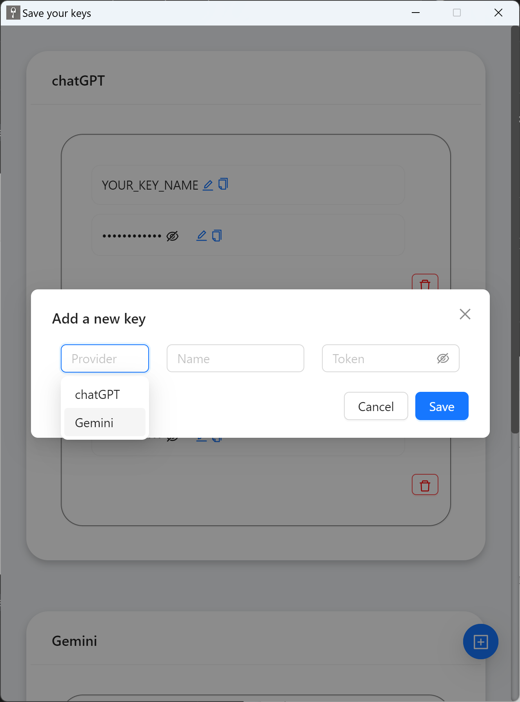

# Save My Keys

A simple desktop app to store your AI service API keys (ChatGPT, Gemini, etc.) locally on your computer.

## What it does

- Save API keys locally in your user files
- Organize keys by provider (ChatGPT, Gemini)
- Basic functions: add, copy, edit, delete keys

## Screenshots

View and manage your saved keys: 
  

Add a new provider key: 
  

Delete confirmation: 
  

## How to use

1. Click "+" to add a new key
2. Fill in the provider, name, and your API key
3. Use the copy/edit/delete icons to manage keys

Note: All keys are stored locally in your user files. The app simply helps you organize them.